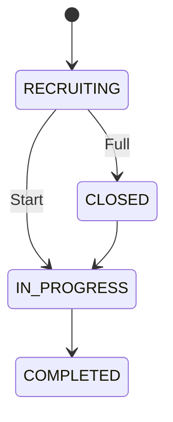
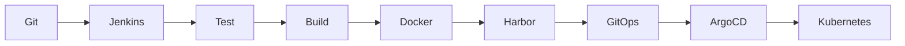

# wanderpool-party

## 1. Overview

`wanderpool-party`는 카풀 모집 도메인의 생명주기를 관리하는 Spring Boot 기반 마이크로서비스입니다.

단순 CRUD 서비스가 아닌, **파티 생성부터 참여, 승인, 운행 완료까지의 도메인 규칙과 데이터 정합성**을 중심으로 설계했습니다.

주요 기능

- Driver만 파티 생성 가능
- 승객의 파티 참여 요청
- Driver의 참여 승인/거절
- 승인 시 현재 탑승 인원 증가
- 정원 도달 시 자동 모집 종료
- 참여 취소/거절 시 포인트 환불 이벤트 생성
- 운행 완료 시 Driver 포인트 적립 이벤트 생성

---

## 2. My Contribution

| 구분 | 내용 |
|---|---|
| 역할 | PL, Backend, DevOps |
| 담당 영역 | Party 도메인 설계, 참여/취소/승인 로직 구현, gRPC 기반 서비스 간 통신, 이벤트 기반 포인트 처리, Jenkins · GitOps 기반 CI/CD 구축 |
| 주요 고민 | MSA 환경에서 서비스 간 데이터 정합성과 도메인 규칙 유지 |

---

## 3. Architecture

> 전체 시스템 아키텍처

온프레미스 Kubernetes 환경에서 MSA 기반 서비스를 구성했으며,
Kong API Gateway를 통해 외부 요청을 라우팅하고 서비스별 Database를 분리했습니다.


---

## 4. Tech Stack

| Category | Stack |
|---|---|
| Language | Java 21 |
| Framework | Spring Boot, Spring Data JPA |
| Communication | REST, gRPC |
| Database | PostgreSQL, Flyway |
| API Docs | Springdoc OpenAPI (Swagger) |
| Test | JUnit5, Mockito, JaCoCo |
| Build | Gradle |
| Infra | Docker, Kubernetes |
| CI/CD | Jenkins, GitLab CI, Harbor, Argo CD |

---

## 5. Domain Model & ERD


### Party

카풀 파티 생성부터 모집, 운행 시작, 완료까지의 생명주기를 관리하는 Aggregate Root입니다.

Party는 출발지, 목적지, 경유지, 일정 정보와 모집 상태를 관리하며, 참여 승인 및 운행 상태 변화에 따라 생명주기를 제어합니다.

| 필드 | 설명 |
|---|---|
| driverMemberId | 파티 생성자 |
| origin | 출발지 정보 |
| destination | 목적지 정보 |
| waypoints | 경유지 목록 |
| departureTime | 출발 시간 |
| arrivalTime | 도착 예정 시간 |
| maxPassengers | 최대 모집 인원 |
| currentPassengers | 현재 승인 인원 |
| status | RECRUITING, CLOSED, IN_PROGRESS, COMPLETED |

### PartyParticipant

파티 참여 요청과 참여자의 상태 및 탑승 위치 정보를 관리합니다.

| 필드 | 설명 |
|---|---|
| memberId | 참여 사용자 |
| pickupLocation | 픽업 위치 및 좌표 |
| dropoffLocation | 하차 위치 및 좌표 |
| pointCost | 참여 비용 |
| paymentDebited | 포인트 차감 여부 |
| status | 참여 상태 |

| 상태 | 설명 |
|---|---|
| PENDING | 승인 대기 |
| ACCEPTED | 승인 완료 |
| REJECTED | 참여 거절 |
| CANCELLED | 참여 취소 |

### PartyWaypoint

파티 경로상의 경유지 정보를 관리합니다.

| 필드 | 설명 |
|---|---|
| partyId | 연결된 파티 |
| orderIndex | 경유지 순서 |
| name | 경유지 이름 |
| latitude | 위도 |
| longitude | 경도 |

---

## 6. Core Features

### Party Lifecycle



### 주요 기능

- 파티 생성
- 파티 검색
- 파티 참여 요청
- Driver의 참여 요청 승인 / 거절
- 참여 상태(PENDING → ACCEPTED/REJECTED) 관리
- 참여 취소
- 운행 시작
- 운행 완료
- Driver 포인트 적립
- Passenger 포인트 환불

---

## 7. Key Design Decisions

### 7.1 Transaction Strategy

파티 참여, 승인, 취소는 여러 데이터가 함께 변경되는 작업입니다.

하나의 트랜잭션에서 다음 작업을 함께 처리하여 상태 변경과 이벤트 생성의 원자성을 보장했습니다.

- Party 상태 변경
- PartyParticipant 상태 변경
- 현재 탑승 인원 변경
- PointCreditOutbox / PointRefundOutbox 이벤트 저장

---

### 7.2 Event Processing (Outbox Pattern)

포인트 적립 및 환불은 Member 서비스가 담당합니다.

Party 서비스는 파티 상태 변경과 이벤트 저장을 동일한 트랜잭션으로 처리한 뒤,
Scheduler가 Outbox 이벤트를 조회하여 Member 서비스로 전달하도록 구성했습니다.

이를 통해 외부 서비스 장애가 발생하더라도 이벤트 유실을 방지하고,
재처리를 통해 데이터 정합성을 유지할 수 있도록 설계했습니다.

```text
Party Service

@Transactional
        │
        ▼
+------------------------+
| Party 상태 변경        |
| PartyParticipant 변경  |
| PointCreditOutbox 저장 |
| PointRefundOutbox 저장 |
+------------------------+
        │
      Commit
        │
        ▼
Outbox Scheduler
        │
        ▼
gRPC
        │
        ▼
Member Service
```

장점

- 도메인 데이터와 이벤트 데이터 정합성 보장
- 이벤트 발행 실패 시 재시도 가능
- 외부 서비스 장애 전파 최소화

---

### 7.3 gRPC Communication

Member, Map 서비스와 내부 통신은 gRPC를 사용했습니다.

적용 이유

- REST 대비 낮은 네트워크 오버헤드
- Protobuf 기반 계약 관리
- 타입 안정성 확보
- 서비스 간 인터페이스 명확화

서비스 간 통신은 Proto 기반 계약을 공유하여 API 변경에 따른 영향 범위를 관리했습니다.

| Service | 목적 |
|---------|------|
| Member | 사용자 검증 |
| Member | Driver 권한 검증 |
| Member | 포인트 처리 |
| Map | 경로 및 위치 정보 조회 |

---

### 7.4 Domain Validation

서비스에서 적용한 주요 도메인 규칙입니다.

| Rule | 설명 |
|------|------|
| Driver만 파티 생성 가능 | 생성 권한 검증 |
| 생성자는 자신의 파티 참여 불가 | 도메인 규칙 |
| 동일 사용자 중복 참여 불가 | 참여 검증 |
| 모집 인원 초과 불가 | 승인 시 검증 |
| 마감된 파티 참여 불가 | 상태 기반 검증 |
| 운행 완료 후 수정 불가 | 상태 기반 검증 |

---

### 7.5 Exception Handling

비즈니스 예외를 명확히 분리하고 `GlobalExceptionHandler`를 통해 일관된 응답 형식을 제공합니다.

대표 예외 코드

- PARTY_NOT_FOUND
- PARTY_ALREADY_CLOSED
- DUPLICATED_PARTICIPANT
- INVALID_PARTY_STATUS
- DRIVER_ONLY_OPERATION

---

## 8. REST API

Swagger(OpenAPI)를 기준으로 관리합니다.

| Method | Endpoint | Description |
|---------|----------|-------------|
| GET | `/api/parties` | 출발지, 목적지, 시간, 상태 조건 기반 파티 검색 |
| GET | `/api/parties/me/created` | 내가 생성한 파티 목록 조회 |
| GET | `/api/parties/me/joined` | 내가 참여한 파티 목록 조회 |
| GET | `/api/parties/{partyId}` | 파티 상세 조회 |
| GET | `/api/parties/{partyId}/participants` | 파티 참여자 목록 조회 |
| POST | `/api/parties` | 카풀 파티 생성 |
| POST | `/api/parties/{partyId}/join` | 파티 참여 요청 |
| POST | `/api/parties/{partyId}/participants/{participantId}/accept` | 참여 요청 승인 |
| POST | `/api/parties/{partyId}/participants/{participantId}/reject` | 참여 요청 거절 |
| POST | `/api/parties/{partyId}/in-progress` | 파티 운행 시작 |
| POST | `/api/parties/{partyId}/complete` | 파티 운행 완료 |
| DELETE | `/api/parties/{partyId}/participants/{participantId}` | 파티 참여 취소 |

---

## 9. Testing

- Unit Test
- Integration Test
- Repository Test
- JaCoCo Coverage Verification
- gRPC Client Mock Test

```bash
./gradlew test
```

---

## 10. Deployment



---

## 11. Run

### Local

```bash
./gradlew bootRun
```

### Test

```bash
./gradlew test
```

### Build

```bash
./gradlew clean build
```

### Docker

```bash
docker build -t wanderpool-party .
```

---

## 12. What I Learned

이 프로젝트를 통해 다음과 같은 내용을 경험했습니다.

- MSA 환경에서 서비스 간 책임 분리
- gRPC 기반 내부 서비스 통신 설계
- 이벤트 기반 데이터 처리와 데이터 정합성 확보
- 트랜잭션 경계 설정 및 도메인 규칙 구현
- Jenkins · Harbor · Argo CD 기반 GitOps 배포 자동화
